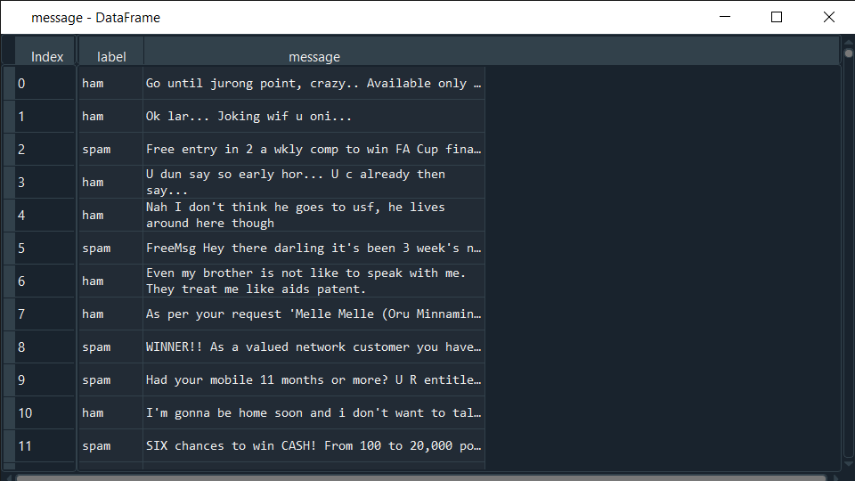
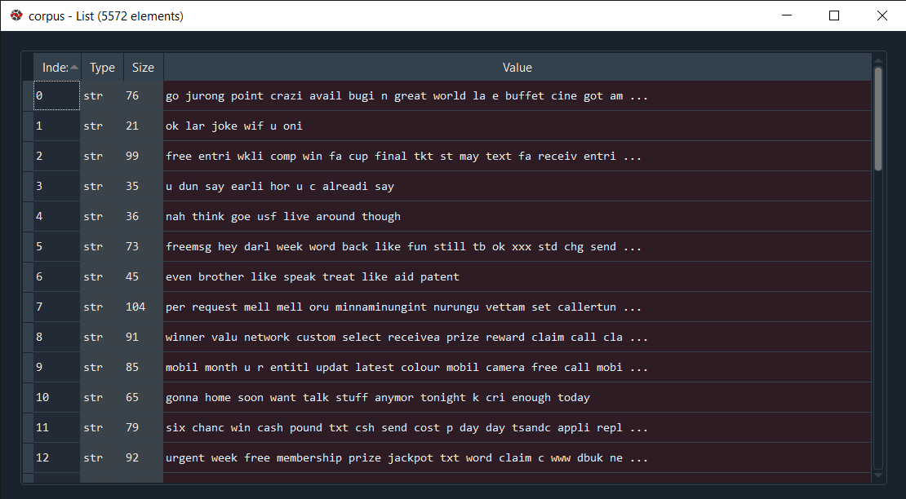
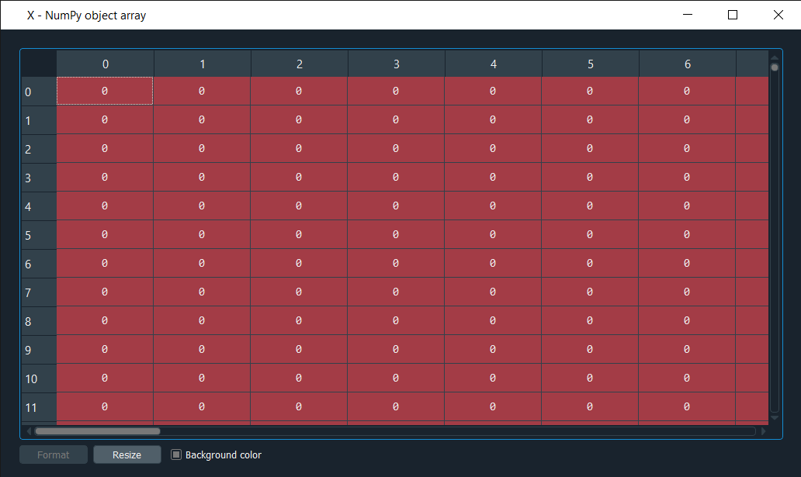
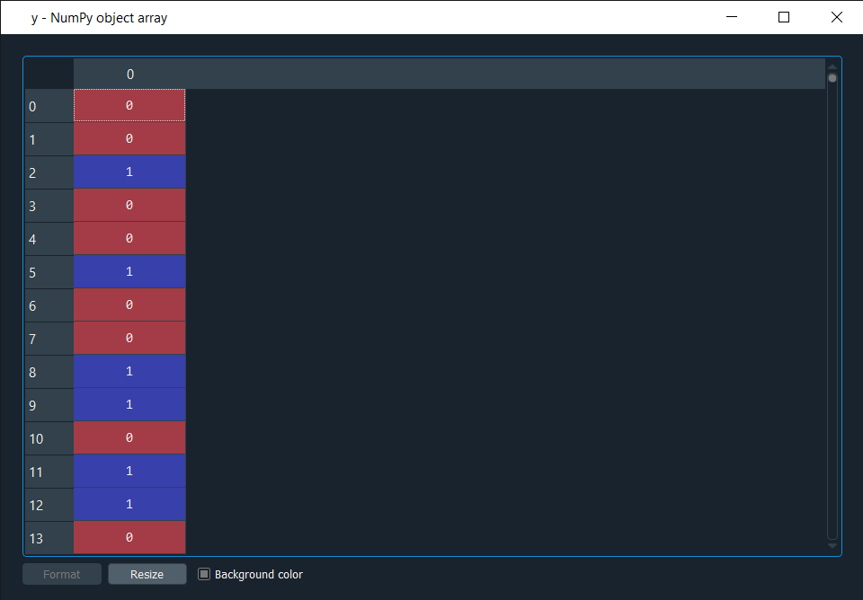
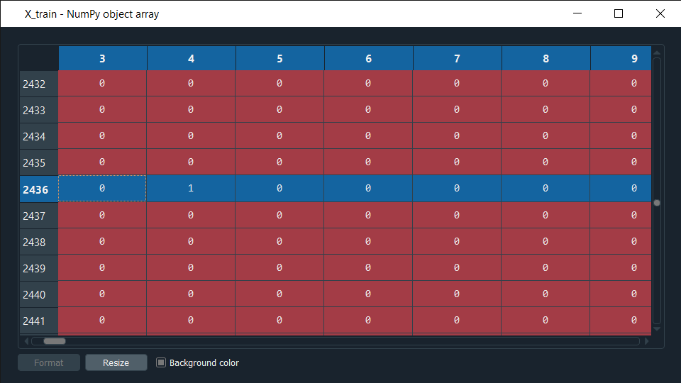
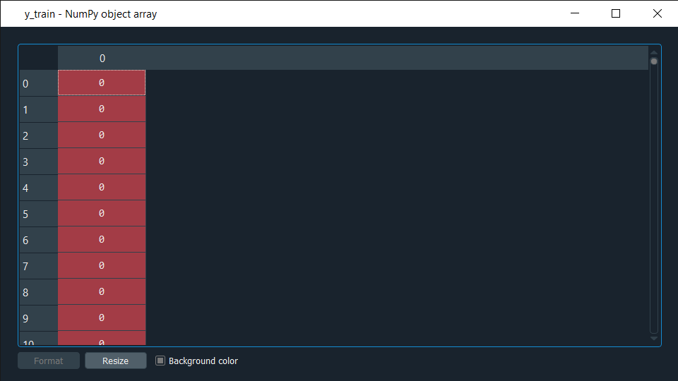
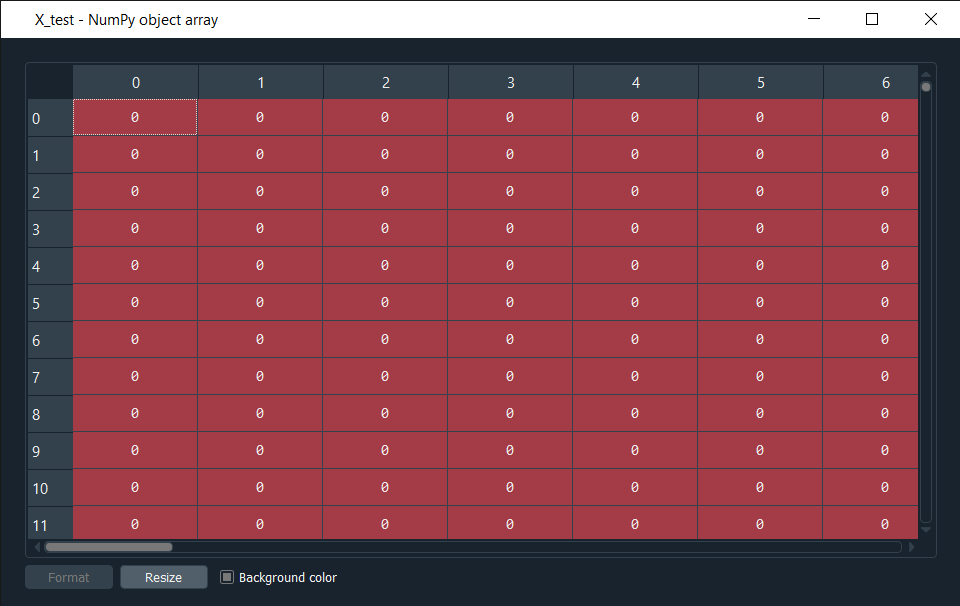
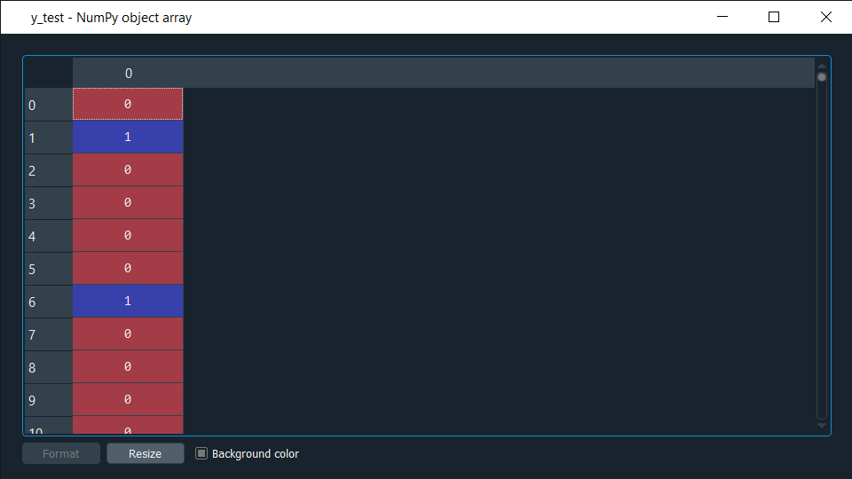
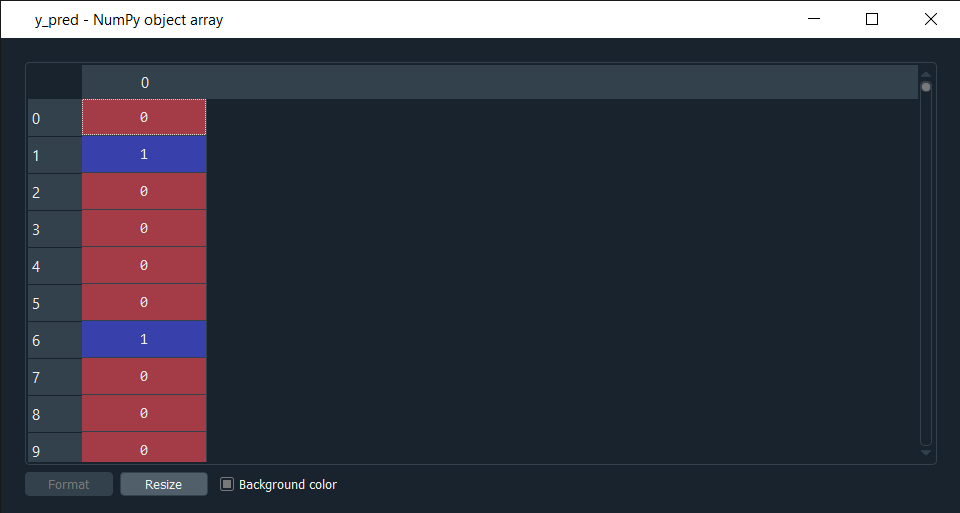
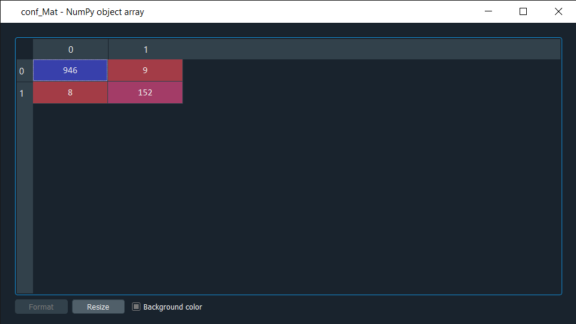

# Problem Description :
  Understanding the problem is a crucial first step in solving any Data Science or Machine Learning Problem.In this, we will explore and understand the process of classifying  messages as spam or not spam. This is called Spam Detection.
  
# Dataset
Let’s start with our spam detection data. We’ll be using the open-source Spambase dataset from the UCI machine learning repository, a dataset SMSspam Collection(https://archive.ics.uci.edu/ml/machine-learning-databases/00228/smsspamcollection.zip) that contains 5572 messages.

#  Text Processing :
Data usually comes from a variety of sources and often in different formats. For this reason, transforming your raw data is essential. Before preprocessing the text we need 
to import some important libraries(i.e nltk,PorterStmmer,stopwords etc).
Some of the standard cleaning steps are listed below
. Lowering case
. Removal of special characters
. Removal of stopwords
. Removal of numbers 
. Word Stemming
   
 After the preprocessing : 
 
 # Bag Of Word  :
 Bag of Words (BOW) is a method to extract features from text documents. These features can be used for training machine learning algorithms.
 
 
 # Encoded The Target Variable
 
 
 # Spliting The Dataset
 
 
 # Model Selection and Prediction
 Here we will be use multinomial Naive Bayes classifier. It is suitable for classification with discrete features (e.g., word counts for text classification).
 Predicted output :
 
 # Peformance metrics
 For checking the performance of the model we will be using Confusion matrix 
 
 This Model is giving 98.47% accuracy
 
 
 
   
   

